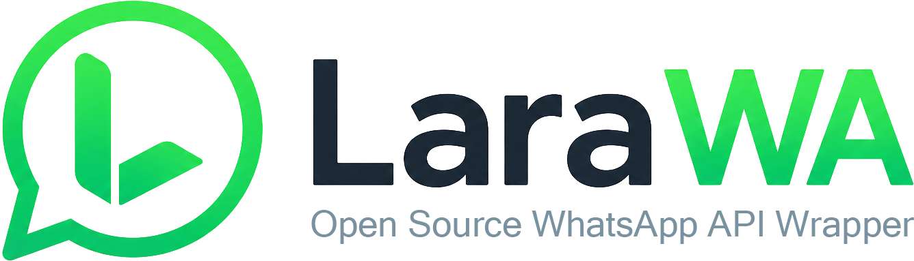

<p align="center">
  
</p>

# LaraWA

[](docs/setup.md)
[](composer.json)
[](composer.json)
[](worker/package.json)
[](docker-compose.yml)
[](LICENSE)

[Website](https://lara-wa.org)

LaraWA is a self-hosted WhatsApp API gateway built with Laravel for the PHP community. It supports Meta's Official WhatsApp Cloud API and a `whatsapp-web.js` Wrapper transport.

It gives developers a dashboard and REST API for connecting Official or Wrapper sessions, sending messages, receiving incoming messages, forwarding events to webhooks, and safely falling back from a definitively unavailable Wrapper session to a linked Official session. Wrapper connectivity runs on [`whatsapp-web.js`](https://github.com/pedroslopez/whatsapp-web.js), while Official sessions communicate with Meta Graph API.

LaraWA is an independent community project. It is not affiliated with, sponsored by, or endorsed by Meta, WhatsApp, or their affiliates. Please use it responsibly and follow the terms and laws that apply to your WhatsApp account and messaging use case.

## Table of Contents

- [Quick Start](#quick-start-guide)
- [Features and Functionality](#features-and-functionality)
- [Sample API Calls](#sample-api-calls)
- [Technical Stack](#technical-stack)
- [Documentation](#documentation)
- [Plugins](#plugins)
- [Contribute Together](#contribute-together)
- [Future Plan](#future-plan)
- [License](#license)

## Quick Start

The easiest way to try LaraWA is with Docker.

```bash
cp .env.example .env
docker compose up -d --build
```

Open the dashboard:

```text
http://localhost:8080
```

On the first visit, LaraWA will show a one-time setup screen. Use it to create the first workspace and site administrator, configure the app URL, check database/storage settings, and finish the installation.

After setup:

1. Login to the dashboard.
2. Open `Sessions`.
3. Create a new WhatsApp session and choose Official Cloud API or WhatsApp Wrapper.
4. For Wrapper, scan the QR code using WhatsApp > Linked devices. For Official, copy the generated callback URL and verify token into the Meta app, then configure its credentials.
5. Wait until the session status becomes `ready`.
6. Create an API key from the dashboard.
7. Start calling the API.

Advance setting, please review the [setup guide](docs/setup.md).

## Features and Functionality

- WhatsApp Web session connection with QR pairing.
- Official Cloud API conversation inbox with 24-hour customer-service window enforcement.
- Meta template synchronization, guided Utility/Marketing template creation and editing, and approved-template sending.
- Multi-session support with persistent browser authentication.
- REST API for text, image, video, file/document, audio, reaction, and bulk messages.
- Send text, images, videos, and files to individual WhatsApp users or groups.
- Incoming message capture and message status tracking.
- Webhook delivery with signed events.
- Dashboard for sessions, API keys, messages, webhooks, audit logs, users, workspaces, and settings.
- Scoped API keys with hashed storage, expiration, IP allow lists, and rate limiting.
- Workspace roles for site admins, workspace admins, and workspace users.
- SQLite by default, with optional PostgreSQL, Redis, and S3-compatible storage.
- Docker-first deployment with app, queue, scheduler, nginx, Redis, PostgreSQL profile, and WhatsApp worker services.
- Early marketplace/plugin structure for dashboard extensions, language packs, and future integration points.

## Sample API Calls

Create an API key in the dashboard, then use it as a bearer token.

Replace:

- `SESSION_UUID` with your WhatsApp session UUID.
- `lwa_your_key_here` with your API key.
- `+1 202-555-0100` with the recipient phone number or WhatsApp chat ID.
- For group messages, use a WhatsApp group chat ID ending in `@g.us`.

### Send a Text Message

```bash
curl -X POST http://localhost:8080/api/v1/sessions/SESSION_UUID/messages/text \
  -H "Authorization: Bearer lwa_your_key_here" \
  -H "Content-Type: application/json" \
  -d '{
    "to": "+12025550100",
    "text": "Hello from LaraWA"
  }'
```

### Send an Image Message

```bash
curl -X POST http://localhost:8080/api/v1/sessions/SESSION_UUID/messages/image \
  -H "Authorization: Bearer lwa_your_key_here" \
  -H "Content-Type: application/json" \
  -d '{
    "to": "+12025550100",
    "media_url": "https://example.com/image.png",
    "mime_type": "image/png",
    "filename": "image.png",
    "caption": "Image sent from LaraWA"
  }'
```

You can also send media with `media_base64` instead of `media_url`. See the [OpenAPI document](docs/openapi.yaml) for the full request and response format.

## Technical Stack

- **Backend:** Laravel 13, PHP 8.4
- **WhatsApp engine:** Node.js worker using `whatsapp-web.js`
- **Frontend assets:** Vite and Tailwind CSS
- **Default database:** SQLite
- **Optional database:** PostgreSQL
- **Optional cache/queue/session backend:** Redis
- **Optional media storage:** S3-compatible storage
- **Deployment:** Docker Compose
- **API format:** REST with OpenAPI documentation
- **License:** MIT

## Documentation

- [Setup guide](docs/setup.md)
- [OpenAPI document](docs/openapi.yaml)
- [Plugin development](docs/plugins.md)
- [Live WhatsApp validation runbook](docs/live-validation.md)
- [Acceptance checklist](docs/acceptance.md)
- [Contributing guide](CONTRIBUTING.md)
- [Security policy](SECURITY.md)

When running outside production, Swagger UI is available at:

```text
http://localhost:8080/docs
```

## Plugins

Language plugins:

- [Japanese language plugin](https://github.com/larawa-community/larawa-lang-ja)
- [Korean language plugin](https://github.com/larawa-community/larawa-lang-ko)
- [Traditional Chinese language plugin](https://github.com/larawa-community/larawa-lang-zh-hant)
- [Simplified Chinese language plugin](https://github.com/larawa-community/larawa-lang-zh-hans)

## Contribute Together

LaraWA is built for the PHP and Laravel community, and contributors are very welcome.

Good ways to help:

- Improve Laravel, API, worker, dashboard, and Docker behavior.
- Add tests and real-world validation notes.
- Improve documentation for beginners.
- Build plugin and marketplace ideas.
- Help translate the dashboard into native languages.

Translation help is especially appreciated. The current Japanese, Korean, and Chinese language work is still rough, and native-language contributors can make LaraWA much easier to use for more people.

Please start with the [contributing guide](CONTRIBUTING.md).

## Future Plan

LaraWA is still young. The current marketplace app structure is an early draft, and more extension points should stay open as the project grows.

Ideas on the roadmap:

- Better marketplace/plugin structure.
- More language packs and better translations.
- SMS fallback integrations through plugins.
- More message provider and notification fallback options.
- More dashboard extension points.
- Improved production deployment examples.
- More examples for Laravel, plain PHP, and common API clients.

LaraWA is inspired by [OpenWA](https://github.com/rmyndharis/OpenWA).

## License

LaraWA is open-sourced under the [MIT license](LICENSE).
